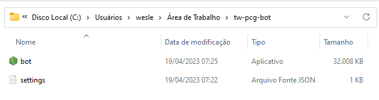

# PGC

This is a bot for catch PCG pokemons in twitch chat, in certain conditions.
By default, this script will try to catch pokemons tier STARTER, S, A, and B
(Starter and S does not show up in the chats...)
Will be used a ultraball when:
- STARTER, S tier
- Tier A or B with base stats greater than 500

Will be used a greatball when:
- Tier A or B with base stats greather than 450 and lower than 500

Will be used a pokeball when:
- Tier B with base stats greater than 400 and lower than 450

# Setting
First of all, create a folder to the executable and put the bot.exe inside it.



After that, create a file called settings.json and put this content:
```json
{
    "TWITCH_OAUTH_TOKEN": "oauth:dkpaceh16uirjk5x6b2raf88jg83131",
    "CHANNEL_TO_LISTEN": "deemonrider",
    "PCG_USER": "PokemonCommunityGame",
    "CHANNEL_LANG": ""
}
```
<b>this will be the settings file, where:</b> <br/>
TWITCH_OAUTH_TOKEN  -> is the oauth token (we will discuss about it in the next topic) <br/>
CHANNEL_TO_LISTEN   -> the channel you'll be listening <br/>
PCG_USER            -> username you'll be listening in the chat <br/>
CHANNEL_LANG        -> language of the chat, set the value to "ptbr" for portuguese chats and let it empty for english chats <br/>

# Usage

You'll need to connect your account in this site to get your oauth token
- https://twitchapps.com/tmi/

After that, you'll set the TWITCH_OAUTH_TOKEN with this value you got.

Now, just execute the bot.exe and enjoy :D.